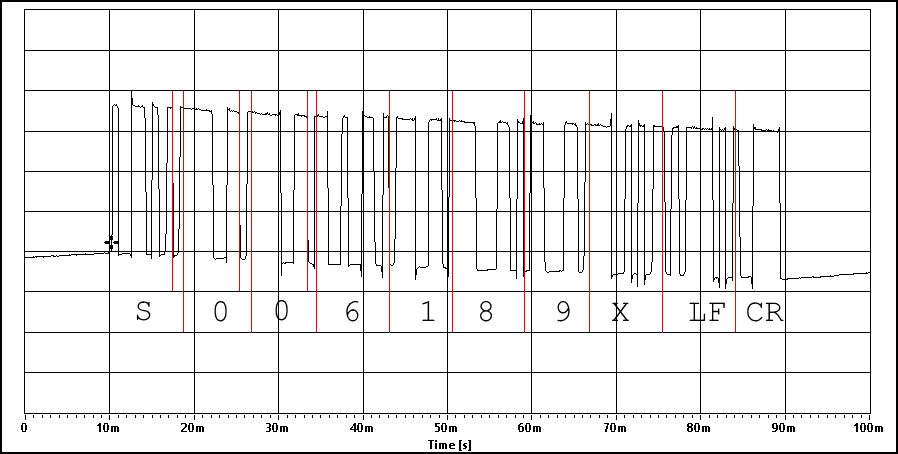

# StackMatGen3TimerAPI
StackMat Generation 3 Timer API

## YuXin Timer

The software works with the "YuXin Cube Timer V1", too. This piece of hardware can be connected to your computer's microphone input via a simple cable: On the timer it's a 2.5mm TS (mono) audio jack, for the PC side you need a 3.5mm audio jack (mono / TS or stereo / TRS). When you use a stereo jack, make sure to connect the **center** (Tip)! Initially, I chose the Sleeve which is not picked up by the software.

The current time display is emitted at regular intervals, in a 10-byte ASCII telegram that totals about 80ms, in what looks like standard serial 12008N1 communication, least significant bit first, low voltage "1", high voltage "0":

- One *instruction* byte
  * For some reason **my** Yuxin timer only ever sends the "S" instruction (0x53).
  * I do _not_ receive A, L, R, C, or Space instructions.
  * As a consequence, [PrismaPuzzleTimer](https://github.com/phillip-hayes/PrismaPuzzleTimer) does show the elapsed time, but is unable to detect the start and end of a solve (!!)
  * Since I only have a single unit that I have already tinkered with I cannot be sure if that's not a home-made malfunction, so __maybe__ Yuxin are not to blame, might well be my own fault.
- six digits, representing the time ("0" = 0x30 ... "9" = 0x39)
- one check digit
- one LF (0x0A)
- one CR (0x0D)

For illustration, here is a plot of how "6.189" gets communicated as "S-006189-X-LF-CR". See the Yuxin folder for more images. This was taken off a unit with PCB date "2016-12-14" using [Soundcard Scope](https://www.zeitnitz.eu/scms/scope_en). To safeguard my PC against potentially harmful input signals, I whipped up a protection circuit with two antiparallel diodes and two resistors as a voltage divider.



Happy cubing!
 
## Trying it out with the YuXin Timer

1. You need Java.
    - Any Java version should be OK (6,7,8).
1. Open a command line (CMD.EXE, Bash)
    - Change to some working directory
    - Check Java installation: `java -version` - this should show that Java is available.
    - Download this repo/branch: `git clone --branch YuxinDocAmendment https://github.com/m9aertner/StackMatGen3TimerAPI.git`
    - Change into the downloaded code: `cd StackMatGen3TimerAPI`
1. Build using [Gradle](http://gradle.org): `./gradlew build`
    - This downloads Gradle (once),
    - then builds the application's code and JAR file.
    - Result is a JAR file: `build/libs/StackMatGen3TimerAPI.jar`
1. Execution
    - Connect the timer with to your computer's Mic port (pink 3.5 mm TRS)
    - Execute: `java -jar build/libs/StackMatGen3TimerAPI.jar`
    - This JAR is executable via `Main-Class` entry in `META-INF/MANIFEST.MF`
    - It feels a bit odd, but *no parameters* are supported. The Mixer `#5` is hard-coded. That works for me, not sure what that *magic constant* means.
    - The app initializes, then waits for data from the timer. Any data recieved is decoded and shown on each _change_.
    - As an example, here's how I start the app, then start the timer (Power button), start a solve, stop at 1s577, reset back to 0m00s000, and finally press Enter to quit.

```
StackMatGen3TimerAPI> java -jar build\libs\StackMatGen3TimerAPI.jar
12, 2017 9:06:47 PM au.com.emc.cubing.stackmat.StackmatManager start
INFORMATION: Starting Stackmat gen 3 manager
Apr 12, 2017 9:06:47 PM au.com.emc.cubing.stackmat.StackmatInterpreter initialize
INFORMATION: Initialising stackmat gen 3 interpreter
Apr 12, 2017 9:06:47 PM au.com.emc.cubing.stackmat.StackmatInterpreter doInBackground
INFORMATION: Starting Stackmat background thread
Apr 12, 2017 9:06:47 PM au.com.emc.cubing.stackmat.Main main
INFORMATION: Press Enter to continue...
0:00:000
0:00:068
0:00:197
0:00:326
0:00:455
0:00:584
0:00:713
0:00:842
0:00:971
0:01:100
0:01:220
0:01:349
0:01:478
0:01:577
0:00:000

Apr 12, 2017 9:06:59 PM au.com.emc.cubing.stackmat.Main main
INFORMATION: Stopping manager...
Apr 12, 2017 9:06:59 PM au.com.emc.cubing.stackmat.StackmatManager stop
INFORMATION: Stopping Stackmat gen 3 manager
```

